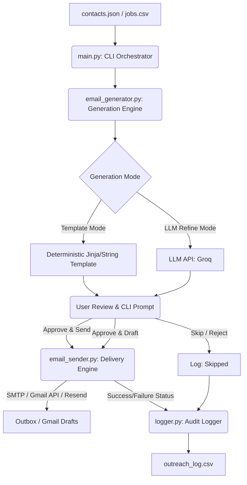
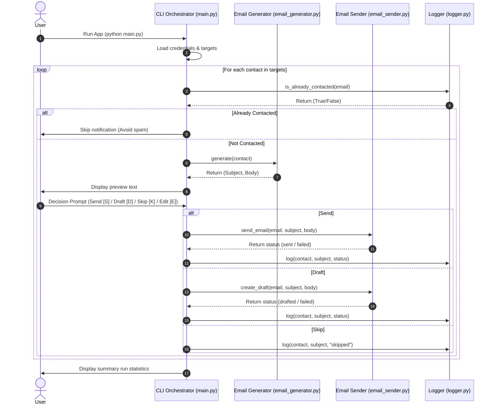

# System Architecture: "The Closer" — Cold Email Writer & Send Bot

This document details the system architecture, component design, data flow, and safety guardrails for **"The Closer"**, a cold email automation and personalization tool designed to help job seekers generate and send high-quality, human-reviewed outreach emails.

---

## 1. Architectural Overview

"The Closer" is designed as a modular, command-line interface (CLI) application. It prioritizes **Human-in-the-Loop (HITL)** approval and **Safety-by-Default** constraints.



---

## 2. Core Modules & Responsibilities

The system is separated into highly cohesive, loosely coupled modules. This separation ensures that logic can be easily explained to students and facilitates swapping out components (e.g., changing the email provider or upgrading from basic templates to an LLM).

| Module | File | Primary Responsibility |
| :--- | :--- | :--- |
| **Orchestrator** | `main.py` | Handles CLI execution, configuration loading (`.env`), reading inputs (`contacts.json`), looping through targets, prompting the user, and coordinating other modules. |
| **Generation Engine** | `email_generator.py` | Takes raw target details and formats/constructs the subject line and email body. Supports deterministic templating and optional LLM refinement. |
| **Delivery Engine** | `email_sender.py` | Authenticates with the mail provider (SMTP or API) and performs delivery or draft creation. Respects `DRY_RUN` mode. |
| **Audit Logger** | `logger.py` | Writes standardized logs (`outreach_log.csv`) detailing timestamps, recipients, roles, templates used, status, and error traces. |

---

## 3. Data Schema & Structures

### Input Schema (`contacts.json` / CSV)
Each contact record must contain:
```json
{
  "recipient_name": "Priya Sharma",
  "recipient_email": "priya@example.com",
  "company": "Acme AI",
  "role": "Backend Engineering Intern",
  "candidate_name": "Jane Doe",
  "candidate_background": "Python developer interested in automation and AI agents",
  "personalization_note": "Company recently launched an AI workflow automation product",
  "portfolio_url": "https://github.com/janedoe",
  "job_url": "https://example.com/job"
}
```

### Audit Log Schema (`outreach_log.csv`)
Logs are appended sequentially.
* Columns: `timestamp`, `recipient_email`, `company`, `role`, `subject`, `status` (`generated`, `drafted`, `sent`, `skipped`, `failed`), `error_message`

---

## 4. Detailed Component Interfaces (API Design)

### A. CLI Orchestrator (`main.py`)
Responsible for running the application. It loads environment variables, reads input files, iterates through the targets, handles human input, and runs the process.

```python
def load_config() -> dict:
    """Loads and validates environment variables from .env."""
    pass

def load_contacts(filepath: str) -> list[dict]:
    """Reads and parses the target contacts JSON or CSV file."""
    pass

def run_cli():
    """Main execution loop that orchestrates generator, sender, and logger."""
    pass
```

### B. Email Generator (`email_generator.py`)
Responsible for producing a structured outreach email based on contact parameters.

```python
class EmailGenerator:
    def __init__(self, template: str = None, use_llm: bool = False):
        """
        Initializes generator.
        :param template: Custom string template. If None, uses default.
        :param use_llm: If True, uses LLM API to refine/write the draft.
        """
        self.template = template or self.get_default_template()
        self.use_llm = use_llm

    def get_default_template(self) -> str:
        """Returns the fallback/default email text template."""
        pass

    def generate(self, contact: dict) -> tuple[str, str]:
        """
        Generates subject line and body for a contact.
        :return: (subject_line, email_body)
        """
        subject = f"Outreach: {contact['role']} role at {contact['company']}"
        # Deterministic format
        body = self.template.format(**contact)
        
        if self.use_llm:
            subject, body = self._refine_with_llm(subject, body, contact)
            
        return subject, body

    def _refine_with_llm(self, subject: str, body: str, contact: dict) -> tuple[str, str]:
        """Optionally uses an LLM (e.g., Groq) to polish tone and layout."""
        pass
```

### C. Email Sender (`email_sender.py`)
Manages authentication and communication with external mail delivery protocols.

```python
class EmailSender:
    def __init__(self, config: dict):
        """
        Initializes credentials, host settings, and safety flags.
        Expected config keys: SMTP_HOST, SMTP_PORT, SMTP_USER, SMTP_PASSWORD, DRY_RUN
        """
        self.config = config
        self.dry_run = config.get("DRY_RUN", True)

    def send_email(self, to_email: str, subject: str, body: str) -> str:
        """
        Delivers the email using smtplib or API.
        If dry_run is True, prints action to terminal without sending.
        :return: 'sent' or 'failed'
        """
        pass

    def create_draft(self, to_email: str, subject: str, body: str) -> str:
        """
        Creates a draft inside the sender's email client (e.g., Gmail Drafts).
        Allows manual UI delivery later.
        :return: 'drafted' or 'failed'
        """
        pass
```

### D. Audit Logger (`logger.py`)
Writes records to local files to prevent sending duplicate emails.

```python
import csv
from datetime import datetime

class OutreachLogger:
    def __init__(self, filepath: str = "outreach_log.csv"):
        self.filepath = filepath
        self._init_file()

    def _init_file(self):
        """Creates CSV file with headers if it does not exist."""
        pass

    def log(self, contact: dict, subject: str, status: str, error: str = ""):
        """Appends a row to the log file."""
        pass

    def is_already_contacted(self, email: str) -> bool:
        """Scans logs to check if recipient has already been emailed to avoid double outreach."""
        pass
```

---

## 5. Interaction Sequence Flow

The following sequence details how the orchestrator processes each record and interacts with the user.



---

## 6. Safety Guardrails & Anti-Spam Architecture

To prevent students from creating spam engines or leaking private data:

1. **Safety Switch (`DRY_RUN`)**: The application defaults to `DRY_RUN=true`. All printouts, templates, and CLI cycles run, but emails are not actually dispatched. The sender prints to console instead.
2. **Deduplication Check**: The logger is checked before any generation step via `is_already_contacted`. If the recipient's email is present in `outreach_log.csv` with a `sent` or `drafted` status, the record is automatically bypassed.
3. **Draft Mode by Default**: We recommend that students use **Option A (Draft Mode)**. Instead of sending directly, the code generates drafts in the user's Gmail box, keeping all delivery actions manually verified.
4. **Length and URL Limiters**: The generator validates that the body text is `< 150` words and checks that it contains exactly one call-to-action (`ask`) to adhere to high-quality outreach standards.

---

## 7. Implementation Roadmap & Milestones

### Milestone 1: Framework & Data Infrastructure
* Setup folder layout.
* Draft `requirements.txt` and `.env.example`.
* Create `logger.py` to support append-logging and deduplication checking.
* Establish `contacts.json` with sample seed records.

### Milestone 2: Generator & Template Validation
* Code `email_generator.py` with standard formatting constraints.
* Validate generated output formatting (length, placeholder substitution).
* Implement optional LLM connection wrapper.

### Milestone 3: Sender Integration
* Code `email_sender.py` utilizing standard Python `smtplib`.
* Enable `DRY_RUN` terminal mock output.
* (Stretch) Add Gmail API integration for creating Drafts.

### Milestone 4: Orchestrator Loop & CLI Interface
* Connect all components inside `main.py`.
* Build interactive review command loop (Accept, Draft, Skip, Edit).
* Conduct end-to-end dry-run demo test.
